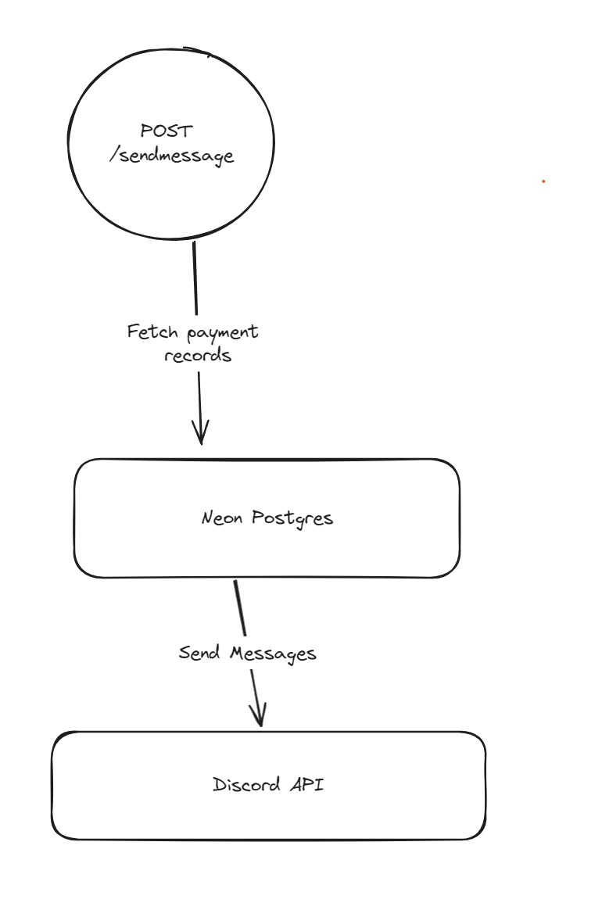

## Spotify Family Reminder API
This is a api that will send message to a certain discord channel based on a postgres database.

This is use with a CRON Job together to remind someone to pay their spotify family bill

### The Flow
